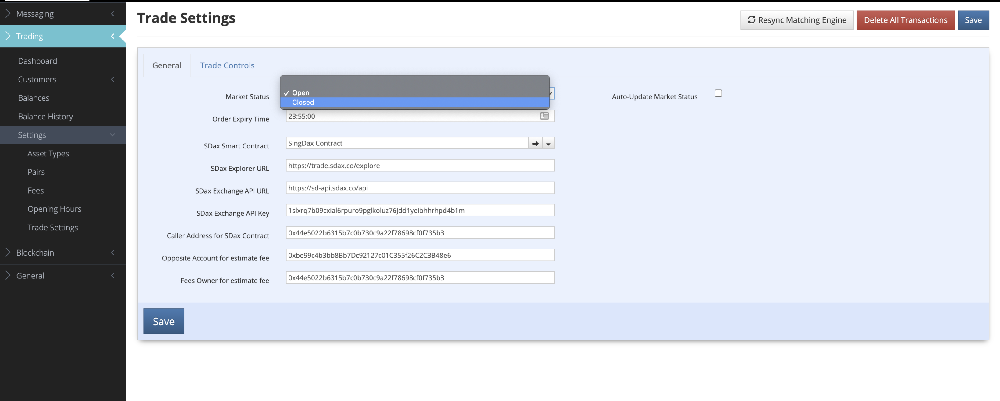
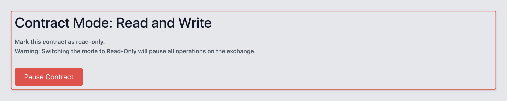

# SMART CONTRACT MIGRATION GUIDE (WIP)

## PRE-MIGRATION

1. Notify customers by email about system upgrade and down time.
2. Activate system upgrade message on WEB - 3 days in advance
3. Backup Whitelisted Addresses from Source smart contract
   
        export INSTANCE_ID=PROD_56_AC && truffle exec contract_upgrade/backupWL.js -h=offchain -s='8a2f899613797f6ae8f65e5831be39d8b9e4bfee' --network=bsc_mainnet_ac --compile

4. Deploy target smart contract and save contract address

        export INSTANCE_ID=[INSTANCE] && export RESTORE_CONTRACT=YES && node process_sol_js && truffle compile && truffle migrate --network=[TARGET_CONTRACT_NETWORK] -f 2 --to 2
        
        // example: export INSTANCE_ID=PROD_137_AC && node process_sol_js && truffle compile && truffle migrate --network matic_mainnet -f 2 --to 2
5. Restore WL (+ additional addresses if any) to Target smart contract
   
        export INSTANCE_ID=PROD_137_AC && truffle exec contract_upgrade/restoreWL.js -s='8a2f899613797f6ae8f65e5831be39d8b9e4bfee' -t='3D47037A40d01e7BB902b9E49D9249145b542b10' -h=offchain --network=matic_mainnet
6. Make sure only SOURCE and TARGET SC are on SQL DB table **contract**

## MIGRATION

1. Disable Dashboard & set reason message

        UPDATE [dbo].[global_config]
        SET
            [config_value] = 1
        WHERE [config_key] = 'web_settings_disableDashboard'
        GO

        UPDATE [dbo].[global_config]
        SET
            [config_value] = 'ACX is currently carrying out a scheduled system upgrade from 12pm to 5pm (Singapore time). '
        WHERE [config_key] = 'web_settings_disableDashboardMsg'
2. Close Market on HX
   
3. Set smart contract to read-only from ADMIN
   
   
4. Create full backup of source smart contract

        export INSTANCE_ID=[INSTANCE] && truffle exec contract_upgrade/backup.js -h=offchain -s=[SOURCE_CONTRACT_ADDRESS] --network=[SOURCE_CONTRACT_NETWORK] --compile

        // PROD BSC: export INSTANCE_ID=PROD_56_AC && truffle exec contract_upgrade/backup.js -h=offchain -s='8a2f899613797f6ae8f65e5831be39d8b9e4bfee' --network=bsc_mainnet_ac --compile

5. Backup Indexer/mongodb
        
        cd indexer/cli
        cp .env.example .env
        yarn dump

6. Export to CSV Unconsolidated Balance report from ADMIN.

7. Restore backup to target smart contract:
   **Before running restore script, check gasPrice https://gasstation-mainnet.matic.network/ and adjust if necessary on *sol/truffle-config.js* on the network configuration (e.g. matic_mainnet).**

        export INSTANCE_ID=[INSTANCE] && truffle exec contract_upgrade/restore.js -s=[SOURCE_CONTRACT_ADDRESS] -t=[TARGET_CONTRACT_NETWORK] -h=offchain --network=[TARGET_CONTRACT_NETWORK]

        // PROD BSC to POLYGON
        export INSTANCE_ID=PROD_137_AC && truffle exec contract_upgrade/restore.js -s='8a2f899613797f6ae8f65e5831be39d8b9e4bfee' -t='3D47037A40d01e7BB902b9E49D9249145b542b10' -h=offchain --network=matic_mainnet --compile

8. After Restore checks:
     1. If restore script logs different hashes between source and target smart contracts, run compareHashes.js to troubleshoot.
  
                export INSTANCE_ID=PROD_137_AC && truffle exec contract_upgrade/compareHashes.js -s='8a2f899613797f6ae8f65e5831be39d8b9e4bfee' -t='3D47037A40d01e7BB902b9E49D9249145b542b10' -h=offchain --network=matic_mainnet
      2. Connect local ADMIN to target smart contract:
        - Make sure Ledger Hashcode is displayed
        - Generate Unconsolidated Balance report and compare with source report. Must be exact same numbers for all accounts.

9.  Update network/contract address on PROD DB.
   
        BEGIN
        UPDATE [dbo].[global_config]
        SET
        [config_value] = '0x3D47037A40d01e7BB902b9E49D9249145b542b10'
        WHERE [config_key] = 'global_contractAddress'

10. Reset Indexer
    
        curl --location --request GET 'https://indx.aircarbon.co/reset-sync' --header 'x-api-key: 53d22de76bdec67c530a50751a0721ae4af4f0961cba098e1d0f0c9d93967647'

11.  Check GasPrice and GasLimit values on DB
12.  Test internal corporate transactions (see Indexer list them)
13.  Mint TEST, and trade.
14.  Disable TEST token type
15. OPEN MARKET - enableDashboard, open on HX
